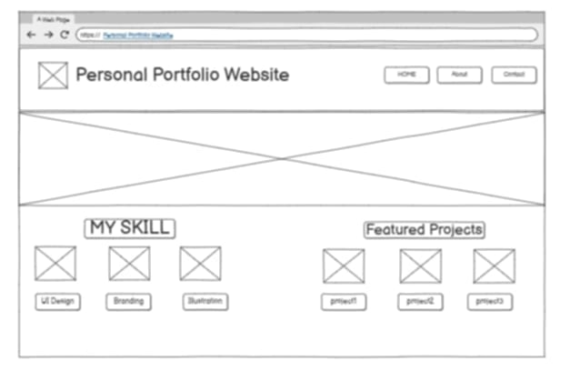
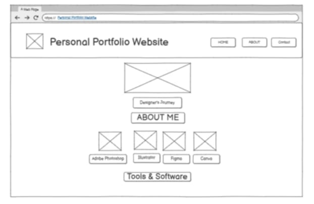

# Personal Portfolio Website

Welcome to my **Personal Portfolio Website** – a clean and modern showcase of my work, skills, and contact information, built to highlight my projects and professional experience.

🔗 **Live Website**: [https://rjsingua221.github.io/Personal-Portfolio-Website/](https://rjsingua221.github.io/Personal-Portfolio-Website/)

---

## 📌 Summary

This responsive and user-friendly portfolio website is designed to present who I am as a developer and designer. It features:

- A professional landing page
- A dedicated section for my personal and academic background
- A projects showcase with links to GitHub repositories
- A contact form
- Smooth navigation and modern layout

---

## 🖼️ Logo

The website uses a **personalized text-based logo**, reinforcing brand identity with simplicity and clarity.

---

## 🔲 Wireframe

The design follows a clean, structured layout. Below are the wireframes used to build the website:

### Homepage Wireframe

### About Section Wireframe

### Projects Section Wireframe

---

## 🎨 Color Scheme

The website uses a **modern and minimalist color palette** to maintain a professional aesthetic:

| Color Name         | Hex Code   | Usage                        |
|--------------------|------------|------------------------------|
| Primary Blue        | `#007bff`  | Buttons, highlights          |
| White               | `#ffffff`  | Background, text contrast    |
| Light Gray          | `#f8f9fa`  | Section backgrounds          |
| Dark Gray           | `#343a40`  | Footer, navbar               |
| Accent Black        | `#000000`  | Headings, key text areas     |

---

Feel free to explore the source code and clone or fork this repository to create your own portfolio site!
